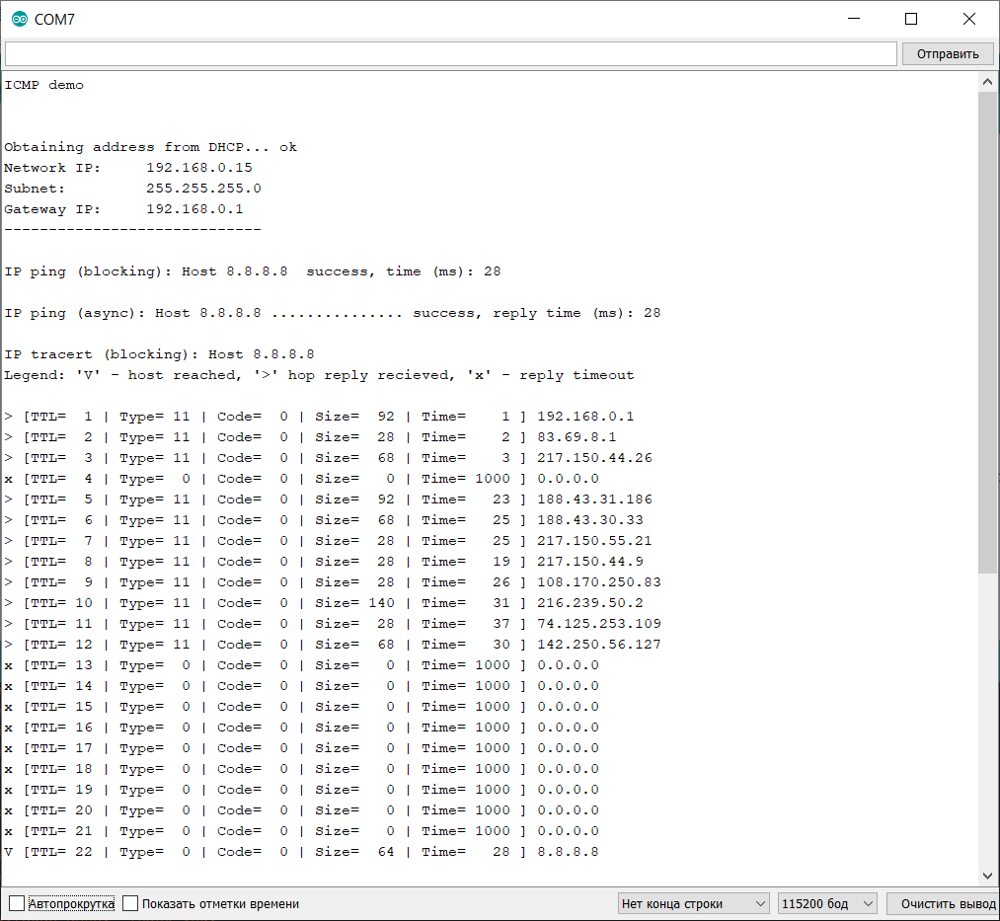

# Arduino
 Various Arduino stuff

## ICMP
ICMP library for Ethernet library 2.0.0, IMCP Ping and ICMP traceroute examples included as `icmp.ino` file.

W5100 & W5500 are supported.

Unfortunately, at this time no any possibility to use ICMP library as usual Arduino library. This is need a little modification of Ethernet 2.0.0 library.

